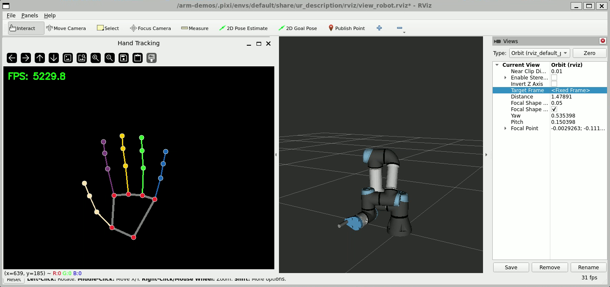

Usage
=====

.. contents::
   :local:
   :depth: 2

Launch the robot driver
-----------------------

For real hardware:

.. code-block:: console

   $ pixi run launch-lan

For simulated hardware:

.. code-block:: console

   $ pixi run launch-sim

This will launch the robot driver, MoveIt, and an RViz window with the robot model loaded.

Run the arm demo
----------------

In a new terminal, run:

.. code-block:: console

   $ pixi run arm-demo

This will connect to the camera and then open an OpenCV window with the camera view and hand landmark visualizations.

.. note::

   At this point you should have two terminal sessions open, one running the robot drivers and one running the demo.
   If you are using WSL, you should have a third terminal session open running the :doc:`WSL camera connection <Camera Connection>` script.

Congratulations! The robot arm should now follow the hand's position in the camera frame.
See the ``src/arm_demo`` folder for the structure and code that runs the arm demo node, and ``pixi.toml`` for the ``arm-demo`` launch command.
